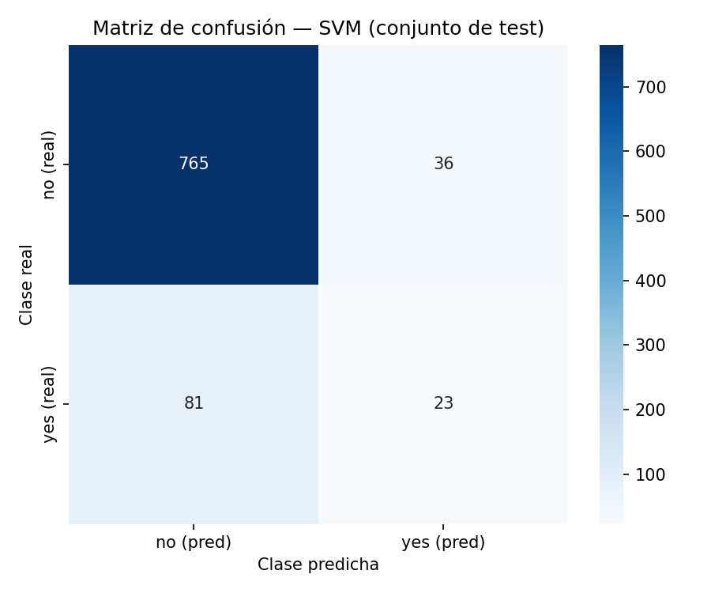

# INF-8239 Ciencia de Datos II

## Unidad 01 — Ejercicio 01

### Dataset público y SVM reproducible

**Estudiante:** PENDIENTE DE COMPLETAR
**Estado del dataset:** PENDIENTE DE APROBACIÓN DEL DOCENTE

---

## 1. Identificación del dataset

- **Nombre:** Bank Marketing
- **Fuente:** UCI Machine Learning Repository (dataset 222)
- **Licencia:** Creative Commons Attribution 4.0 International (CC BY 4.0), verificada en la página oficial de UCI
- **URL:** https://archive.ics.uci.edu/dataset/222/bank+marketing
- **DOI:** 10.24432/C5K306
- **Autores:** Sérgio Moro, Paulo Cortez, Rita (Universidad del Minho, Portugal), 2014
- **Target:** `y` — suscripción a depósito a plazo (yes/no)
- **Candidato alternativo comparado:** Wine Quality (UCI 186, CC BY 4.0, DOI 10.24432/C56S3T)

## 2. Pregunta

¿Es posible predecir, a partir de variables disponibles **antes** del resultado, si un cliente suscribirá un depósito a plazo durante una campaña de telemarketing? Se excluye `duration` (documentada por UCI como información posterior al evento).

## 3. Auditoría

| Aspecto | Valor |
| ------- | ----- |
| Filas (modelado / población) | 4 521 / 45 211 |
| Columnas | 17 (6 numéricas + 9 categóricas + target, sin `duration`) |
| Missing values | 0 (0.0 %) |
| Duplicados exactos | 0 |
| Target | binario: `no` 88.5 %, `yes` 11.5 % (desbalance ~7.7:1) |
| Identificadores | no existen |
| Constantes / alta cardinalidad | ninguna |
| Leakage | `duration` excluida (documentada por UCI como post-outcome) |

## 4. Metodología

- **Split:** `train_test_split(test_size=0.20, random_state=42, stratify=y)` → train 3 616 / test 905 (mismo split para baseline y SVM).
- **Preprocessing dentro del Pipeline:** `ColumnTransformer` — numéricas (`SimpleImputer(median)` + `StandardScaler`), categóricas (`SimpleImputer(most_frequent)` + `OneHotEncoder(handle_unknown="ignore")`). El test permanece aislado hasta la evaluación final.
- **Baseline:** `DummyClassifier(strategy="most_frequent")`.
- **SVM:** `build_svm()` → `StandardScaler` + `SVC(kernel="rbf", probability=True, random_state=42)`, anidado tras el preprocesamiento.
- **Cross-validation:** `GridSearchCV` con `StratifiedKFold(n_splits=5, shuffle=True, random_state=42)`, `scoring="f1_macro"`, sobre entrenamiento únicamente. Grid: `C` en {0.1, 1, 10}, `gamma` en {scale, 0.01, 0.1}.

## 5. Resultados

Valores generados por código (`reports/svm_metrics.csv`), conjunto de test (n=905):

| Modelo | Accuracy | Precision | Recall | F1 | F1 Macro | ROC-AUC |
| ------ | -------: | --------: | -----: | -: | -------: | ------: |
| Baseline | 0.8851 | 0.0000 | 0.0000 | 0.0000 | 0.4695 | — |
| SVM (C=10, gamma=scale) | 0.8707 | 0.3898 | 0.2212 | 0.2822 | 0.6056 | 0.6660 |

Mejores hiperparámetros (CV): **C=10, gamma="scale"**, F1 macro en CV = **0.5991** ± 0.0174.

## 6. Matriz de confusión

TN=765 · FP=36 · FN=81 · TP=23.

## 7. Análisis de errores

El error dominante son los **falsos negativos**: 81 de los 104 clientes que realmente suscribieron fueron clasificados como "no" (tasa de FN 77.9 %). Los falsos positivos son solo 36 (4.5 % de los "no" reales). El baseline, al predecir siempre "no", acierta en el 88.5 % pero **nunca detecta un suscriptor real** (F1 = 0.0): el accuracy es engañoso bajo desbalance. El SVM comete 117 errores, pero identifica 23 suscriptores reales que el baseline no detectaría, con un F1 macro 29 % superior (0.6056 vs 0.4695) y ROC-AUC 0.666 (discriminación moderada, superior al azar).

## 8. Conclusión

El dataset utilizado fue Bank Marketing (UCI 222, CC BY 4.0) con la pregunta de predecir la suscripción a un depósito a plazo con variables previas al resultado. La auditoría mostró 4 521 filas de modelado (45 211 en población completa), 17 columnas, cero missing, cero duplicados y un target binario muy desbalanceado (88.5 %/11.5 %), además de una variable de leakage documentada por la propia UCI (`duration`), excluida del modelo. El baseline DummyClassifier alcanzó accuracy 0.8851 al predecir siempre "no", con F1 macro 0.4695 y F1 0.0: evidencia de que el accuracy engaña bajo desbalance. El SVM, optimizado por GridSearchCV con StratifiedKFold(5) solo sobre entrenamiento (mejores: C=10, gamma=scale; F1 macro CV 0.5991), obtuvo sobre el test aislado: accuracy 0.8707, precision 0.3898, recall 0.2212, F1 0.2822, F1 macro 0.6056 y ROC-AUC 0.6660. El análisis de errores revela 81 falsos negativos (77.9 % de los suscriptores reales) frente a 36 falsos positivos (4.5 %): el SVM identifica 23 suscriptores que el baseline no detecta, con F1 macro 29 % superior. Las limitaciones incluyen el uso de la muestra del 10 % por viabilidad computacional de SVM (recomendada por UCI), el desbalance, la procedencia de una sola entidad portuguesa (2008–2010) y la no interpretabilidad del kernel RBF. En conclusión, el SVM supera al baseline en todas las métricas relevantes del problema real, aunque su recall sigue bajo: es defendible como herramienta de segmentación o ranking de probabilidad de suscripción, no como decisión autónoma; se recomienda explorar pesos de clase y calibración manteniendo la exclusión de `duration`.

## 9. Repositorio

PENDIENTE DE COMPLETAR CON URL DE GITHUB
